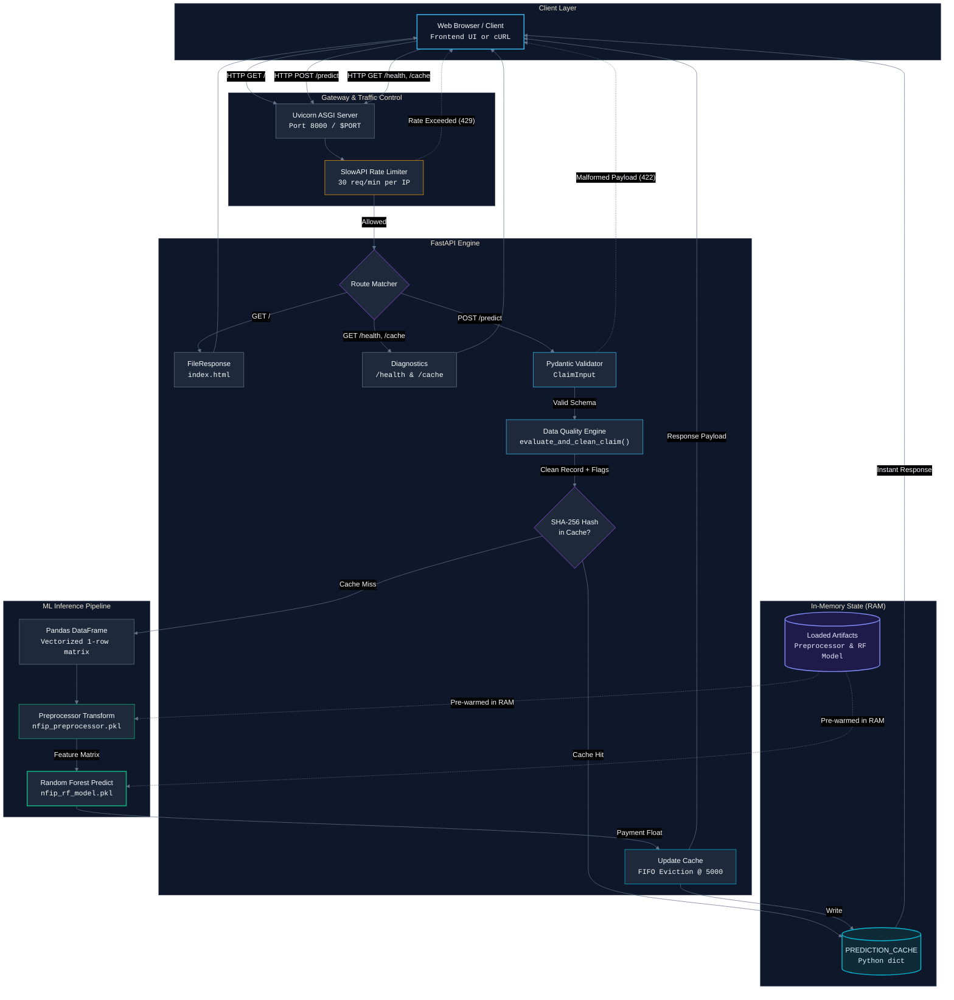

## 1. Data cleaning and integrity issues

| # | Problem | Evidence | Resolution |
|---:|---|---|---|
| 1 | **Duplicate claims** | 40 `-R` records duplicated corresponding base claims. | Removed the 40 `-R` records, leaving **2,000 unique claims**. |
| 2 | **Inconsistent `dateOfLoss` format** | `core` used ISO format such as `2024-09-26T00:00:00.000Z`; `legacy_bdx` used `DD-MM-YYYY`. | Parsed each source with its appropriate format and converted both to a common datetime representation. |
| 3 | **Payment dates before loss** | Six claims had `mostRecentPaymentDate = 1942-10-12` even though their losses occurred years later. | Treated those payment dates as invalid and set them to `NaN`. |
| 4 | **Construction date after loss** | Ten claims had `originalConstructionDate = 2025-06-01` while their losses occurred before 2025. | Set those construction dates to `NaN`. |
| 5 | **Invalid latitude values** | Three latitudes were outside the valid geographic range: `-93.5`, `-91.0`, and `-90.5`. | Set only the invalid latitude values to `NaN`. |
| 6 | **State-coordinate mismatch** | Several coordinates were geographically impossible for their stated state, such as Florida claims with latitude around `-82`. | Set only the inconsistent coordinate, latitude or longitude, to `NaN`; retained the claim. |
| 7 | **Monetary unit mismatch between sources** | `legacy_bdx` monetary values were approximately **1,000 times smaller** than equivalent `core` values. | Multiplied monetary fields in `legacy_bdx` by `1,000`. |
| 8 | **Zero property/replacement values** | 167 claims had zero property or replacement values, including claims with substantial damage or payment. | Treated zero `buildingPropertyValue` and `buildingReplacementCost` as missing rather than genuine `$0` values. |
| 9 | **Negative payment amounts** | One claim had negative building, contents, and net payment values. | Set negative payment values to `NaN`. |
| 10 | **Inconsistent flood-zone capitalization** | Values such as `ae`, `x`, `a`, and `ah` occurred alongside uppercase versions. | Standardized values with `strip().upper()`. |
| 11 | **Missing values** | Several fields had substantial missingness, including `floodWaterDuration` at approximately 79% and `floodEvent` at approximately 28%. | Did not delete rows; missing values were handled during ML preprocessing. |
| 12 | **High-cardinality ZIP code** | `reportedZipCode` had 1,047 unique values, with 752 occurring only once. | Dropped the field from the ML model because one-hot encoding would create sparse, poorly supported features. |
| 13 | **Strongly skewed monetary variables** | Many monetary variables had very large right tails. | Did not delete outliers; investigated extreme records and retained legitimate high-value claims. |
| 14 | **Negative water-depth values** | There were 110 negative values, including one `-99`. | Retained them because there was not enough schema or domain evidence to prove they were invalid. |
| 15 | **Extreme `floodWaterDuration`** | One claim had a duration of `195`, while most non-missing values were `1` or `2`. | Flagged it as suspicious but retained it because it could not be proven invalid. |
| 16 | **Damage greater than property or replacement value** | Six directly observable cases had building damage exceeding the property or replacement value. | Investigated the cases individually and retained them because the relationship was not sufficiently defined to classify them as data errors. |
| 17 | **Payment greater than coverage** | 21 claims had payment exceeding building coverage; one had an especially large gross payment. | Investigated the cases but retained them because payment fields appeared to have accounting or gross-payment semantics. |
| 18 | **Very low damage but high payment** | Nine claims had `buildingDamageAmount = $1` but payments greater than `$10,000`. | Flagged this as a semantic inconsistency but retained the claims because it could reflect claim or payment accounting behavior. |
| 19 | **Rare categorical values** | Rare flood-zone values such as `AHB`, `AOB`, and `D` were present. | Retained them because there was insufficient evidence that they were invalid. |
| 20 | **Categorical codes stored as numbers** | `occupancyType`, `elevatedBuildingIndicator`, and `primaryResidenceIndicator` were numeric dtypes but represented categories. | Treated them as categorical features during modeling rather than continuous numerical variables. |

## 2. Frame and build a model

### Task

I chose to predict the **building damage amount** for each NFIP claim using a
regression model.

### Split

After cleaning the data, I had **1,782 claims with a known building damage
amount**. I split these into **80% training data (1,425 claims)** and **20%
test data (357 claims)**.

Since the damage amounts were highly skewed, I divided them into a few damage
ranges and used those ranges for **stratified sampling**. This helped ensure
that both the training and test sets contained a similar mix of small, medium,
and high-value claims. I also used **5-fold cross-validation** to check how
consistent the model's performance was.

### Result

The simple median baseline had an MAE of about **$51,463**.

My best model was a **Random Forest trained on the log-transformed target**,
which achieved a test MAE of about **$38,197 across 357 claims**. This is about
a **25.8% improvement over the baseline**.

Across 5-fold cross-validation, the model achieved an average MAE of about
**$42,991 ± $7,777**.

### Caveat

The claim amounts are heavily skewed, with a small number of very large claims.
The log transformation helped the model perform better overall, but it still
tends to **underestimate very large claims**. Also, the relatively small
dataset means performance can vary between different train/test splits, which
is why I included the 5-fold cross-validation result.

## 3. Running portal

A web portal was developed to evaluate raw National Flood Insurance Program
(NFIP) claims. The application accepts a standardized claim record, predicts
the final **building damage amount** (building claim payment), and runs data
integrity checks to flag anomalous values.

### Required inputs

The model requires the following fields:

| | |
|---|---|
| `yearOfLoss` | `state` |
| `countyCode` | `latitude` |
| `longitude` | `floodEvent` |
| `causeOfDamage` | `ratedFloodZone` |
| `occupancyType` | `numberOfFloorsInTheInsuredBuilding` |
| `elevatedBuildingIndicator` | `primaryResidenceIndicator` |
| `totalBuildingInsuranceCoverage` | `totalContentsInsuranceCoverage` |
| `buildingPropertyValue` | `buildingReplacementCost` |
| `waterDepth` | `floodWaterDuration` |
| `loss_month` | `building_age` |

### Live portal

The live portal is hosted on Render:

**[Open the NFIP Claims Prediction Portal](https://genairate-assesment.onrender.com/)**

### Tech stack

- **Backend:** FastAPI and Uvicorn (Python)
- **Machine learning:** Scikit-learn (Random Forest Regressor), Pandas, and Joblib
- **Frontend:** Plain HTML, CSS, and vanilla JavaScript
- **Deployment and hosting:** Render, configured as a single-service deployment

The frontend is served natively through FastAPI to avoid cross-origin issues.

### Safeguards

- **Rate limiting:** SlowAPI limits the `POST /predict` endpoint to **30
  requests per minute per client IP address**. Requests above this limit
  receive HTTP `429 Too Many Requests`.
- **Prediction caching:** Identical cleaned claim inputs are cached in memory
  using a SHA-256 hash. The cache stores up to **5,000 entries** and evicts the
  oldest inserted entry when it reaches capacity. Cached values are lost when
  the application restarts.

## 4. Steps to run the website locally

### Prerequisites

- Python 3.10 or newer
- Git
- The model files in the `Models` folder:
  - `nfip_preprocessor.pkl`
  - `nfip_rf_model.pkl`

### Setup and start the backend

From the repository root, run the following commands in PowerShell:

```powershell
git clone <repository-url>
cd nfip-assessment

py -m venv .venv
.venv\Scripts\Activate.ps1

python -m pip install --upgrade pip
pip install -r requirements.txt

uvicorn Backend.main:app --host 127.0.0.1 --port 8000
```

If PowerShell blocks virtual-environment activation, run this once in the
current PowerShell session and then activate the environment again:

```powershell
Set-ExecutionPolicy -Scope Process -ExecutionPolicy Bypass
.venv\Scripts\Activate.ps1
```

### Open the website

With the backend running, open the following URL in a browser:

**[http://127.0.0.1:8000/](http://127.0.0.1:8000/)**

The root URL opens the project landing page. Select **Open prediction portal**
or open **[http://127.0.0.1:8000/portal](http://127.0.0.1:8000/portal)** to use
the claim form. Select **How it works** or open
**[http://127.0.0.1:8000/readme](http://127.0.0.1:8000/readme)** to view the
project documentation. The FastAPI application serves all frontend pages, so
no separate frontend server is required. The API documentation is available at
**[http://127.0.0.1:8000/docs](http://127.0.0.1:8000/docs)**.

To stop the local server, press `Ctrl+C` in the terminal.

## 5. System design


